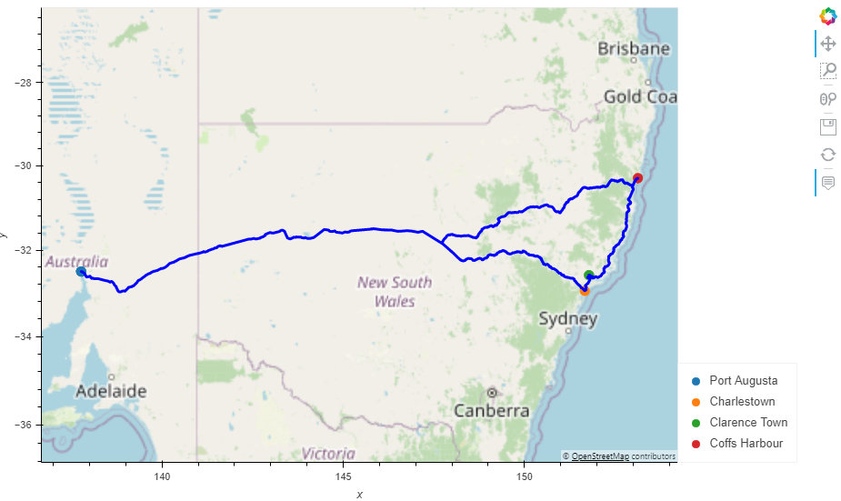

# World_Weather_Analysis
## Purpose
The purpose of this project was to further our skills in pandas dataframes, such as dropping data, reordering columns, adding columns, and calling infromation from API's. We also practiced our skills in the map plots by creating and manipulating data to portrey a map plot we want to see. In deliverable 3, we used gv.Path to create an itinerary between 4 cities (I pick Australia), then showed the route of our trip on the map. 
## Deliverable 1

.

## Deliverable 2

.

## Deliverable 3

.
